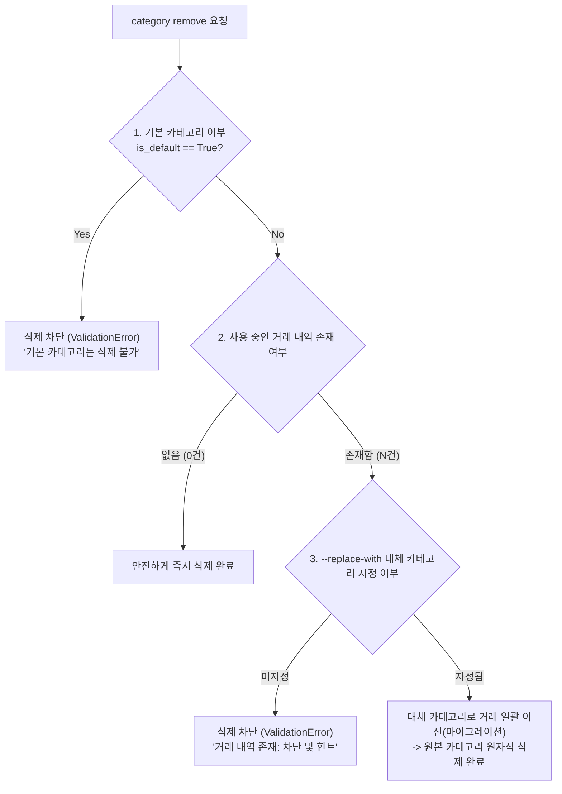

# 🏷️ 카테고리 수명주기 및 참조 무결성(Reference Integrity) 정책 문서

> **문서 개요**: 본 문서는 네이토 사전평가 항목 #3(카테고리 삭제 시 대체 전략 및 최소 행동 규칙 정책 부재)을 완벽히 해결하기 위해 작성된 공식 정책 문서입니다. 가계부 분류 체계의 일관성과 데이터 참조 무결성을 보장하기 위한 3대 핵심 정책을 규정합니다.

---

## 1. 카테고리 분류 체계 및 성격 구분

본 시스템의 카테고리는 데이터 안정성을 위해 두 가지 계층으로 엄격히 구분됩니다.

| 구분 | 대상 카테고리 | 특징 및 권한 |
|---|---|---|
| **시스템 기본 카테고리 (Default Categories)** | `food`, `transport`, `living`, `salary`, `entertainment`, `shopping`, `medical`, `etc` (총 8종) | 최초 실행 시 `./data/categories.jsonl`에 자동 시드되며, 시스템 필수 항목으로 **삭제가 절대 불가** 합니다. |
| **사용자 정의 카테고리 (Custom Categories)** | 사용자가 `category add <name>`으로 직접 생성한 카테고리 | 자유롭게 추가 가능하며, 아래의 무결성 검증 정책을 통과할 경우에만 삭제가 허용됩니다. |

---

## 2. 카테고리 삭제 시 3대 핵심 정책



### 2.1 [정책 1] 시스템 기본 카테고리 삭제 차단 정책
* **규칙**: `is_default=True` 플래그를 가진 카테고리는 어떤 경우에도 삭제할 수 없습니다.
* **이유**: 가계부 핵심 분류 기준이 유실되어 월별 요약 및 기본 집계가 왜곡되는 것을 방지합니다.
* **오류 메시지**: `[오류] 기본 카테고리 'food'는 삭제할 수 없습니다.`

### 2.2 [정책 2] 참조 무결성 보호(차단) 정책 (기본 동작)
* **규칙**: 해당 카테고리를 참조하는 거래 내역이 단 1건이라도 존재하는 경우, 임의 삭제를 차단합니다.
* **이유**: 카테고리가 삭제되어 거래 내역이 고아(Orphaned) 레코드가 되거나 유효하지 않은 카테고리를 참조하는 데이터 손상을 방지합니다.
* **행동 가이드**: 사용자는 해당 카테고리의 거래 내역을 먼저 삭제/수정하거나, 아래의 [정책 3]을 활용해야 합니다.

### 2.3 [정책 3] 대체 카테고리 마이그레이션 이전 정책 (확장 옵션)
* **규칙**: 사용 중인 카테고리를 불가피하게 정리해야 할 경우, `--replace-with <대체카테고리>` 옵션을 함께 전달합니다.
* **동작 흐름**:
  1. 지정된 대체 카테고리의 존재 유무를 사전 검증합니다.
  2. 삭제 대상 카테고리를 참조하던 모든 거래(`Transaction.category`)의 값을 대체 카테고리명으로 일괄 갱신합니다.
  3. 거래 데이터와 카테고리 데이터를 각각 원자적(`atomic replace`)으로 저장한 뒤 대상 카테고리를 삭제합니다.
* **실행 예시**:
  ```bash
  python3 -m budget_app category remove leisure --replace-with entertainment
  # 출력: [삭제 및 이전 완료] category=leisure -> entertainment
  ```
