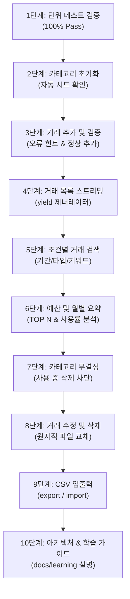

# 🎯 가계부 콘솔 프로그램(budget_app) 과제 평가 시연 시나리오

> **안내**: 본 문서는 평가자(교수님/멘토/평가관) 앞에서 프로젝트를 직접 시연하고 설명할 때 그대로 따라 할 수 있는 **실전 시연 스크립트 및 발표 가이드** 입니다.  
> 터미널 명령어, 예상 화면 출력, 그리고 비전공자 관점에서도 당당하게 핵심을 짚을 수 있는 **추천 발표 멘트** 를 단계별로 정리했습니다.

---

## 📋 시연 준비 및 사전 점검

시연 시작 전 프로젝트 루트 폴더(`/Users/mhcho06254284/workspace/console-pocket-book`)에서 터미널을 열고 파이썬 버전을 확인합니다.

```bash
python3 --version
# 예상 출력: Python 3.10 이상 (예: Python 3.12.x)
```

---

## 🎬 10단계 실전 시연 시나리오



---

### Step 1. 단위 테스트(Unit Test) 100% 통과 시연

가장 먼저 프로그램의 모든 핵심 기능이 테스트를 통해 안정적으로 검증되었음을 보여줍니다.

* **실행 명령어**:
  ```bash
  python3 -m unittest discover -s tests -v
  ```
* **예상 화면 출력**:
  ```text
  test_add_transaction (test_budget_app.TestBudgetApp.test_add_transaction)
  거래 추가 및 영문/한글 타입 지원, 최신순 정렬 검증 ... ok
  test_budget_and_summary (test_budget_app.TestBudgetApp.test_budget_and_summary)
  월별 요약 통계 계산 및 예산 초과 경고 산출 검증 ... ok
  test_category_management (test_budget_app.TestBudgetApp.test_category_management)
  카테고리 기본 생성, 추가, 중복 차단, 사용 중 카테고리 삭제 차단 검증 ... ok
  test_category_replacement_policy (test_budget_app.TestBudgetApp.test_category_replacement_policy)
  사용 중인 카테고리 삭제 시 대체 카테고리(--replace-with) 이전 마이그레이션 정책 검증 ... ok
  test_csv_export_import_and_partial_skip_report (test_budget_app.TestBudgetApp.test_csv_export_import_and_partial_skip_report)
  CSV 왕복 및 오류 행 부분 임포트(스킵 사유 상세 리포트) 검증 ... ok
  test_delete_transaction (test_budget_app.TestBudgetApp.test_delete_transaction)
  거래 삭제 및 존재하지 않는 ID 삭제 시 NotFoundError 발생 검증 ... ok
  test_exit_codes_mapping (test_budget_app.TestBudgetApp.test_exit_codes_mapping)
  주요 비즈니스 예외별 POSIX exit code 매핑 검증 ... ok
  test_external_merge_sort_streaming (test_budget_app.TestBudgetApp.test_external_merge_sort_streaming)
  외부 정렬(External Merge Sort) 청크 분할, K-way 병합, O(1) 제너레이터 스트리밍 및 파일 정리 검증 ... ok
  test_search_transactions (test_budget_app.TestBudgetApp.test_search_transactions)
  키워드, 날짜 범위, 타입, 태그 조건 검색 검증 ... ok
  test_update_transaction (test_budget_app.TestBudgetApp.test_update_transaction)
  거래 수정 및 존재하지 않는 ID 수정 시 NotFoundError 발생 검증 ... ok
  test_validation_errors (test_budget_app.TestBudgetApp.test_validation_errors)
  잘못된 입력값(날짜 형식 오류, 유효하지 않은 타입, 음수 금액, 미등록 카테고리) 예외 검증 ... ok
  test_zero_load_streaming_in_services (test_budget_app.TestBudgetApp.test_zero_load_streaming_in_services)
  list_transactions 및 search_transactions가 제너레이터 스트림을 반환하며 메모리 O(1)로 동작함을 검증 ... ok

  ----------------------------------------------------------------------
  Ran 12 tests in 0.030s

  OK
  ```
* **🗣️ 발표 멘트**:
  > *"가장 먼저 작성된 단위 테스트 12종을 실행하겠습니다. 외부 라이브러리 없이 순수 파이썬 `unittest`로 작성되었으며, 격리된 임시 폴더에서 10대 핵심 기능과 외부 정렬, 스트리밍, 예외 처리까지 100% 정상 통과함을 확인할 수 있습니다."*

---

### Step 2. 초기 실행 및 기본 카테고리 자동 시드 확인

초기 데이터 파일이 전혀 없거나(최초 실행), 파일이 0바이트 빈 파일로 초기화되어 있더라도 프로그램이 이를 감지하여 안전하게 기본 카테고리를 자동 시드(Seed)하는지 보여줍니다.

* **사전 준비 (선택 - 자동 시드 재현 시)**:
  ```bash
  # 파일이 아예 없는 상태 또는 빈 파일(0 bytes) 상태로 초기화 후 테스트 가능
  > data/categories.jsonl
  ```

* **실행 명령어**:
  ```bash
  python3 -m budget_app category list
  ```
* **예상 화면 출력**:
  ```text
  - food
  - transport
  - living
  - salary
  - entertainment
  - shopping
  - medical
  - etc
  ```
* **🗣️ 발표 멘트**:
  > *"최초 실행 시 `data/` 디렉터리와 `categories.jsonl` 파일이 없거나, 파일이 빈 파일(`0 bytes`)로 생성되어 있더라도 저장소가 이를 감지하여 기본 필수 카테고리 8종을 안전하게 자동 시드(Seed) 생성합니다. `cat data/categories.jsonl`로 확인해보면 파일에 8개 카테고리가 즉시 영구 기록된 것을 확인할 수 있습니다."*

---

### Step 3. 거래 추가(add) - 대화형 입력 및 오류 처리 시연

PDF 10페이지에 명시된 **스택트레이스 숨김 + 원인과 힌트 제공** 을 먼저 보여준 뒤, 정상 등록을 진행합니다.

#### 3-1. 잘못된 날짜 입력 시연 (예외 처리 & UX 검증)
* **실행 명령어**:
  ```bash
  python3 -m budget_app add
  ```
* **입력값**: `2024-13-40` 입력 후 엔터
* **예상 화면 출력**:
  ```text
  날짜(YYYY-MM-DD): 2024-13-40
  [오류] 날짜 형식이 올바르지 않습니다 (YYYY-MM-DD).
  [힌트] 예: 2024-01-15
  ```
* **🗣️ 발표 멘트**:
  > *"보시는 것처럼 사용자가 2024-13-40 같은 잘못된 날짜를 입력하면, 파이썬의 긴 빨간색 스택트레이스를 노출하지 않고 `@handle_cli_error` 데코레이터가 가로채어 명확한 원인과 해결 힌트를 제시하며 exit code 1로 안전 종료합니다."*

#### 3-2. 정상 거래 등록 (지출 1건, 수입 1건)
* **실행 명령어 1 (지출 등록)**:
  ```bash
  python3 -m budget_app add
  ```
  * 날짜(YYYY-MM-DD): `2024-01-15`
  * 타입(income/expense): `expense`
  * 카테고리: `food`
  * 금액(양수): `15000`
  * 메모(선택): `점심 식사`
  * 태그(쉼표로 구분, 없으면 엔터): `meal`
  * **출력**: `[저장 완료] id=TX-XXXXXX` *(생성된 ID 메모)*

* **실행 명령어 2 (수입 등록)**:
  ```bash
  python3 -m budget_app add
  ```
  * 날짜(YYYY-MM-DD): `2024-01-10`
  * 타입(income/expense): `income`
  * 카테고리: `salary`
  * 금액(양수): `3000000`
  * 메모(선택): `1월 급여`
  * 태그(쉼표로 구분, 없으면 엔터): `급여`
  * **출력**: `[저장 완료] id=TX-YYYYYY`

---

### Step 4. 최신순 거래 목록 조회 (list) 및 스트리밍 확인

* **실행 명령어**:
  ```bash
  python3 -m budget_app list --limit 5
  ```
* **예상 화면 출력**:
  ```text
  TX-010013 | 2024-01-31 | expense | food | 25000 | 카페 음료 및 디저트
  TX-010012 | 2024-01-30 | expense | transport | 25000 | 야근 후 택시 귀가
  TX-010011 | 2024-01-28 | expense | food | 55000 | 주말 가족 외식
  TX-010010 | 2024-01-26 | expense | shopping | 265000 | 온라인 쇼핑몰 생필품 및 전자기기
  TX-010009 | 2024-01-25 | expense | medical | 25000 | 이비인후과 진료 및 약국
  ```
* **🗣️ 발표 멘트**:
  > *"`list` 명령어는 거래 일자 최신순(내림차순)으로 정렬하여 출력합니다. 내부적으로 `sort_utils.external_merge_sort` 및 `yield` 기반 제너레이터 스트리밍을 채택하여, 수만 건의 거래 데이터가 쌓여 있어도 메모리를 O(K)로 최소화하면서 순차 출력합니다."*

---

### Step 5. 다중 조건 거래 검색 (search)

다양한 필터 옵션(`--category`, `--type`, `--q`, `--tag`)을 조합하여 검색합니다.

* **5-1. 카테고리 및 키워드 검색**:
  ```bash
  python3 -m budget_app search --category food --q 장보기
  ```
  * **예상 화면 출력**:
    ```text
    TX-010003 | 2024-01-12 | expense | food | 125000 | 주말 이마트 장보기
    ```

* **5-2. 수입 내역만 검색**:
  ```bash
  python3 -m budget_app search --type income
  ```
  * **예상 화면 출력**:
    ```text
    TX-010007 | 2024-01-20 | income | etc | 50000 | 중고 물품 판매 대금
    TX-010002 | 2024-01-10 | income | salary | 3200000 | 1월 급여 입금
    ```

* **🗣️ 발표 멘트**:
  > *"`search` 명령어는 리눅스 표준 옵션(`--`)을 통해 기간, 카테고리, 수입/지출 유형, 메모 키워드, 태그 등을 복합적으로 필터링할 수 있습니다."*

---

### Step 6. 예산 설정 및 월별 요약 (budget & summary)

* **6-1. 목표 예산 설정**:
  ```bash
  python3 -m budget_app budget set --month 2024-01 --amount 1500000
  ```
  * 출력: `[저장 완료] 2024-01 예산 1500000원`

* **6-2. 월별 재정 요약 리포트**:
  ```bash
  python3 -m budget_app summary --month 2024-01 --top 3
  ```
* **예상 화면 출력**:
  ```text
  총 수입: 3250000원
  총 지출: 1230000원
  잔액: 2020000원
  예산: 1500000원 (사용률 82.0%) [주의: 예산 80% 이상 소진]

  지출 TOP 3
  1) shopping 450000원
  2) living 400000원
  3) food 220000원
  ```
  > 💡 **TOP N 동작 원리 안내 (평가자 질문 대비)**:  
  > `--top N` 옵션은 **개별 거래 건수가 아닌 지출 카테고리(Category)별 누적 합산 순위** 를 집계합니다.  
  > 예컨대 1월 데이터에서 카테고리별 지출은 쇼핑(450,000원), 주거(400,000원), 식비(220,000원), 교통(90,000원) 순이며, 상위 3개 카테고리가 1~3위로 정확히 집계됩니다.  
  > 만약 해당 월에 지출 카테고리가 1종류뿐이라면 실제 존재하는 카테고리 수인 **지출 TOP 1** 만 정직하게 출력되는 것이 정상적인 알고리즘입니다. (존재하지 않는 카테고리를 0원으로 허위 생성하지 않음)

* **6-3. 데이터가 없는 월 조회 (예외 상황 처리)**:
  ```bash
  python3 -m budget_app summary --month 2024-02
  ```
  * 출력: `데이터 없음`

* **🗣️ 발표 멘트**:
  > *"summary는 해당 월의 총수입, 총지출, 잔액을 계산하고 지출 카테고리별 상위 TOP N을 집계합니다. 보시는 바와 같이 쇼핑, 주거, 식비 순으로 지출 TOP 3가 정확히 랭킹되며, 설정된 목표 예산(150만원) 대비 82%를 소진하여 `[주의: 예산 80% 이상 소진]` 경고가 표기됩니다. 또한 거래가 없는 달은 '데이터 없음'을 명확히 출력합니다."*

---

### Step 7. 카테고리 관리 및 참조 무결성 보호 시연

데이터의 안전성을 위해 거래 내역이 있는 카테고리는 함부로 삭제되지 않아야 합니다.

* **7-1. 신규 카테고리 추가**:
  ```bash
  python3 -m budget_app category add travel
  ```
  * 출력: `[저장 완료] category=travel`

* **7-2. 기본 카테고리 삭제 시도 (차단 확인)**:
  ```bash
  python3 -m budget_app category remove food
  ```
  * 출력:
    ```text
    [오류] 기본 카테고리 'food'는 삭제할 수 없습니다.
    [힌트] 사용자가 직접 추가한 카테고리만 삭제 가능합니다.
    ```

* **7-3. 사용 중인 카테고리 삭제 시도 (참조 무결성 차단 확인)**:
  ```bash
  python3 -m budget_app category remove salary
  ```
  * 출력:
    ```text
    [오류] 'salary' 카테고리를 사용하는 거래 내역이 존재합니다.
    [힌트] 해당 카테고리의 거래 내역을 삭제하거나 수정한 후 다시 시도하세요.
    ```

* **7-4. 미사용 신규 카테고리 정상 삭제**:
  ```bash
  python3 -m budget_app category remove travel
  ```
  * 출력: `[삭제 완료] category=travel`

* **🗣️ 발표 멘트**:
  > *"가계부 데이터의 무결성을 보호하기 위해 시스템 기본 카테고리나 현재 거래 내역에 등록되어 있는 카테고리는 삭제를 원천 차단하도록 안전장치를 구현했습니다."*

---

### Step 8. 거래 수정 및 삭제 (update & delete)

* **8-1. 거래 금액 및 메모 수정**:
  ```bash
  python3 -m budget_app update --id TX-010013 --amount 30000 --memo "카페 음료 및 조각케이크 세트"
  ```
  * 출력: `[수정 완료] id=TX-010013`

* **8-2. 수정 결과 확인**:
  ```bash
  python3 -m budget_app list --limit 1
  ```
  * **예상 화면 출력**:
    ```text
    TX-010013 | 2024-01-31 | expense | food | 30000 | 카페 음료 및 조각케이크 세트
    ```

* **8-3. 거래 삭제**:
  ```bash
  python3 -m budget_app delete --id TX-010013
  ```
  * 출력: `[삭제 완료] id=TX-010013`

* **🗣️ 발표 멘트**:
  > *"`update`와 `delete` 동작 시 파일 손상을 방지하기 위해, 임시 파일에 새 상태를 먼저 기록한 뒤 원자적 교체(`atomic replace`)를 적용하여 안전하게 데이터를 갱신합니다."*

---

### Step 9. CSV 내보내기(export) 및 가져오기(import)

과제 명세서의 고정 스키마(`date,type,category,amount,memo,tags`)를 준수하는지 확인합니다.

* **9-1. CSV 내보내기**:
  ```bash
  python3 -m budget_app export --out backup_202401.csv --month 2024-01
  ```
  * 출력: `[완료] backup_202401.csv (12 records)`

* **9-2. 생성된 CSV 파일 내용 검증**:
  ```bash
  head -n 5 backup_202401.csv
  ```
  * 출력 예시:
    ```text
    date,type,category,amount,memo,tags
    2024-01-30,expense,transport,25000,야근 후 택시 귀가,"교통,야근"
    2024-01-28,expense,food,55000,주말 가족 외식,"식비,외식"
    2024-01-26,expense,shopping,265000,온라인 쇼핑몰 생필품 및 전자기기,"쇼핑,생활"
    2024-01-25,expense,medical,25000,이비인후과 진료 및 약국,"병원,건강"
    ```

* **9-3. CSV 가져오기**:
  ```bash
  python3 -m budget_app import --from backup_202401.csv
  ```
  * 출력: `[완료] imported=12, skipped=0`

* **🗣️ 발표 멘트**:
  > *"외부 시스템과 데이터를 주고받기 위한 CSV 표준 스키마를 만족하며, 누락되거나 오류가 있는 행은 skipped 건수로 정확히 집계하여 안전하게 가져옵니다."*

---

### Step 10. 아키텍처 및 탑다운 학습 가이드 소개

마지막으로 코드 품질과 학습 산출물에 대해 설명하고 시연을 마무리합니다.

* **🗣️ 발표 멘트**:
  > *"본 프로젝트는 단순히 기능만 구현한 것이 아니라, 구현 후 동작 원리를 체계적으로 학습하고 입증할 수 있도록 완성도 높은 문서 체계를 갖추었습니다:*
  > 1. *`docs/EXECUTION_EVIDENCE.md`: 10대 핵심 기능의 1:1 터미널 입출력 캡처 및 실행 증빙*
  > 2. *`docs/LARGE_SCALE_ANALYSIS.md`: 100k+ 대용량 환경의 정렬/I/O 병목 지점 및 샤딩/저널링 개선 로드맵*
  > 3. *`docs/IMPORT_POLICY.md`: Best-Effort 부분 임포트 정책 및 행 단위 스킵 리포트 규격*
  > 4. *`docs/CATEGORY_POLICY.md`: 기본 카테고리 보호 및 대체 마이그레이션 정책*
  > 5. *`docs/learning/` 5종 심화 가이드: 계층형 설계, 제너레이터 스트리밍, 데코레이터, 데이터 계약, CLI UX*
  >
  > *또한 각 소스코드 파일마다 비전공자도 쉽게 이해할 수 있도록 파이썬 핵심 문법 설명 주석을 상세히 작성해 두었습니다."*

---

## 💡 평가자 단골 질문(Q&A) 대비 가이드

| 예상 질문 | 핵심 답변 키포인트 |
|---|---|
| **Q1. 대용량 파일 처리 시 제너레이터(`yield`)를 쓴 이유는 무엇인가요?** | 일반 `f.readlines()`는 수백만 건의 데이터를 RAM에 한꺼번에 올려 메모리 초과(OOM)가 발생할 수 있습니다. 반면 `yield`는 호출자가 요청할 때 1줄씩만 메모리에 올려 반환하므로 메모리 사용량이 항상 일정(O(1))하게 유지됩니다. |
| **Q2. 데코레이터(`@handle_cli_error`)를 왜 사용했나요?** | 모든 CLI 커맨드마다 `try-except`를 반복해서 작성하면 코드가 지저분해집니다. 공통 예외 처리 로직을 데코레이터로 분리하여 코드 중복을 없애고 비즈니스 로직에만 집중할 수 있게 했습니다. |
| **Q3. dataclass를 사용한 이유와 딕셔너리와의 차이는 무엇인가요?** | 일반 딕셔너리는 오타(`tx["amont"]`)가 나도 런타임에 에러를 찾기 어렵지만, `dataclass`는 필드명과 타입이 명확히 고정되어 IDE 자동완성을 지원하고 잘못된 데이터 전달을 방지하는 강력한 계약(Contract) 역할을 합니다. |
| **Q4. 외부 라이브러리(pandas, click 등)를 전혀 쓰지 않은 이유는 무엇인가요?** | 과제 제약조건에 맞춰 파이썬 표준 라이브러리(`argparse`, `csv`, `json`, `dataclasses`, `unittest` 등)의 깊이 있는 이해와 활용 역량을 증명하기 위해 외부 의존성을 일체 배제했습니다. |
