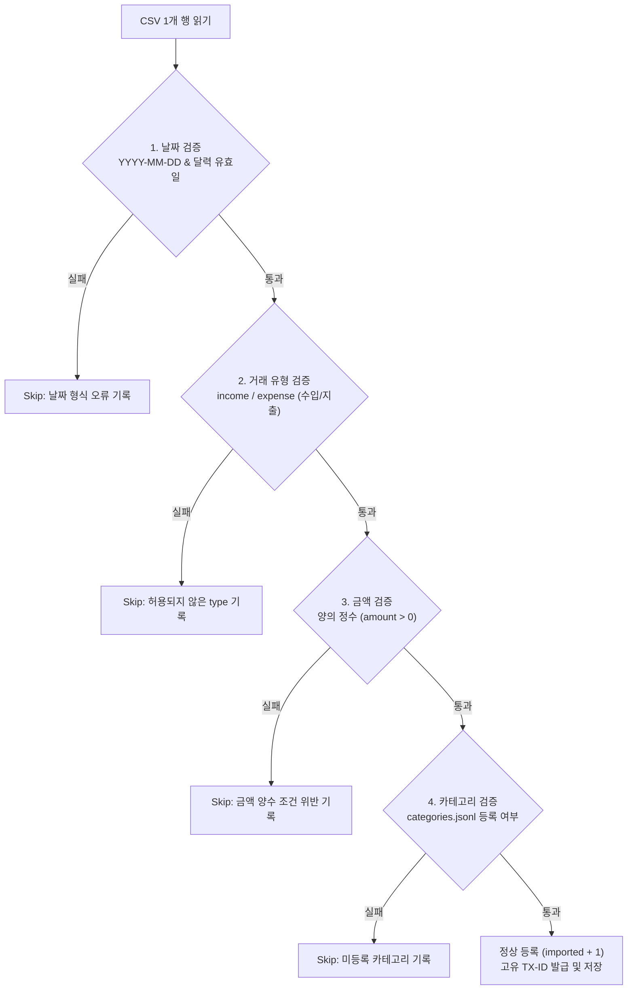

# 📥 CSV 부분 임포트(Partial Import) 및 오류 처리 정책 문서

> **문서 개요**: 본 문서는 네이토 사전평가 항목 #16(부분 import 정책 및 스킵 사유 문서화/리포트 부재)을 완벽히 해결하기 위해 작성된 공식 정책 문서입니다. CSV 대량 데이터 가져오기 시 적용되는 트랜잭션 정책, 오류 판정 기준, 상세 리포트 포맷 및 재시도 가이드를 정의합니다.

---

## 1. 트랜잭션 정책: All-or-Nothing vs Best-Effort 비교

외부에서 생성된 수백~수천 건의 CSV 데이터를 가져올 때, 일부 행에 잘못된 날짜나 오탈자가 포함될 수 있습니다. 본 시스템은 사용자의 비즈니스 연속성을 위해 **Best-Effort 부분 임포트 정책** 을 채택합니다.

| 정책 구분 | 장점 | 단점 | 채택 여부 |
|---|---|---|:---:|
| **All-or-Nothing (전체 롤백)** | 데이터가 완벽할 때만 들어가므로 완전한 무결성 유지 | 10,000건 중 단 1줄의 오타로 인해 9,999건의 정상 데이터까지 모두 취소되어 사용자 불편 초래 | 미채택 |
| **Best-Effort (부분 허용)** | 정상 데이터는 즉시 반영하고, 문제 행만 격리/리포트하여 수동 수정 기회 제공 | 오류 행에 대한 상세한 추적 및 명확한 스킵 리포트가 필수적 | **최종 채택** |

---

## 2. 행 단위 검증 및 스킵(Skip) 판정 기준

`import_csv` 파이프라인은 CSV의 각 행을 순회하며 다음 4가지 핵심 계약(Contract)을 순차 검증합니다. 하나라도 위반 시 해당 행은 즉시 스킵(Skip)되고 카운트와 원인이 수집됩니다.



---

## 3. 스킵 상세 리포트 포맷 규격

CLI에서 `python -m budget_app import --from <file.csv>` 실행 시, 스킵된 데이터가 존재하면 즉시 터미널에 구조화된 상세 리포트가 출력됩니다.

### 3.1 콘솔 출력 규격 예시
```text
[완료] imported=98, skipped=2
[스킵 상세 리포트]
  - 14행: 날짜 형식이 올바르지 않습니다 (YYYY-MM-DD). (입력값: '2024-13-40')
  - 57행: 금액은 0보다 큰 양수여야 합니다. (입력값: '-15000')
```

### 3.2 내부 반환 데이터 구조 (`services.py > import_csv`)
```python
{
    "imported": 98,
    "skipped": 2,
    "skipped_details": [
        {
            "row": 14,
            "reason": "날짜 형식이 올바르지 않습니다 (YYYY-MM-DD).",
            "raw": {"date": "2024-13-40", "type": "expense", "amount": "10000", ...}
        },
        {
            "row": 57,
            "reason": "금액은 0보다 큰 양수여야 합니다.",
            "raw": {"date": "2024-01-15", "type": "expense", "amount": "-15000", ...}
        }
    ]
}
```

---

## 4. 데이터 정제 및 재시도(Re-import) 워크플로우

1. **로그 확인**: 출력된 `[스킵 상세 리포트]`의 행 번호와 실패 원인을 확인합니다.
2. **CSV 파일 수정**: 오류가 발생한 해당 행의 값(예: 날짜 오타 수정, 미등록 카테고리 등록)을 보정합니다.
3. **카테고리 사전 등록**: 오류 원인이 "존재하지 않는 category"인 경우, `python -m budget_app category add <name>` 명령어로 카테고리를 먼저 생성한 후 다시 임포트를 실행합니다.
4. **멱등성(Idempotency) 관리**: 이미 등록된 건은 고유 ID가 새로 발급되므로, 전체 재임포트 시에는 실패했던 행만 별도 CSV로 추출하여 가져오는 것을 권장합니다.
