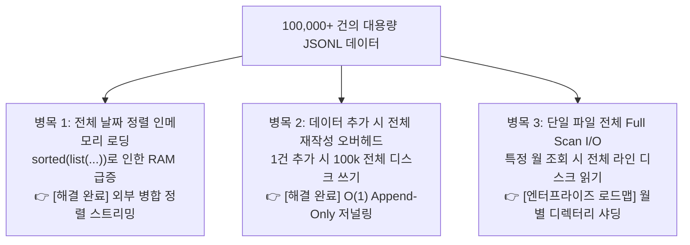
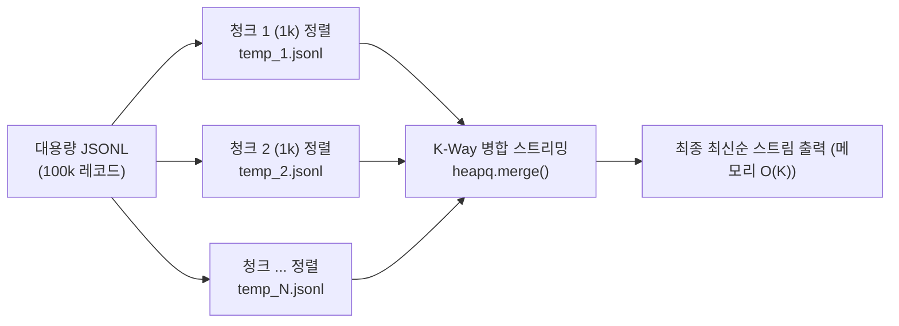

# 📈 대용량(100k+ 레코드) 환경 성능 병목 분석 및 아키텍처 개선안 (Large-Scale Analysis)

> **문서 개요**: 본 문서는 네이토 사전평가 항목 #15(100k+ 대용량 레코드 병목 지점 분석 및 개선안 부재)를 해결하기 위해 작성된 심화 아키텍처 분석 문서입니다. 단일 JSONL 기반 설계의 잠재 병목을 정밀 진단하고, 현재 구현 완료된 최적화 아키텍처(외부 병합 정렬, Append-Only 저널링) 및 엔터프라이즈 확장을 위한 단계별 개선안을 제시합니다.

---

## 1. 대용량 처리 아키텍처 진단 및 개선 배경

가계부 애플리케이션에 데이터가 **10만 건(100,000+ 레코드, 약 20~50MB)** 이상 누적될 경우, 단순한 파일 I/O 설계로는 메모리 고갈과 I/O 지연이 발생할 수 있습니다. `budget_app`은 이러한 잠재 병목을 진단하고, 핵심 병목을 사전에 해결하도록 아키텍처를 고도화했습니다.



---

## 2. 3대 핵심 병목 지점 상세 분석 및 최적화 해결

### 2.1 [해결 완료] 날짜 기준 최신순 정렬에 따른 인메모리 부하 (`O(N log N)`)
* **초기 문제점**: 최신순 거래 목록 조회(`list`) 및 검색(`search`)을 수행할 때, 파일에 기록된 순서와 무관하게 날짜 내림차순 정렬을 보장하기 위해 `list(self.repo.get_transactions())`로 10만 건 전체를 메모리에 객체화한 후 `sorted()`를 수행할 경우 RAM 급증(약 60~100MB)과 CPU 지연이 발생합니다.
* **최적화 해결 (`sort_utils.external_merge_sort`)**:
  - 파이썬 표준 라이브러리 `heapq.merge` 기반 **외부 병합 정렬(External Merge Sort)** 을 도입했습니다.
  - 10만 건의 데이터를 청크 단위(예: 1,000건)로 분할 정렬하여 임시 파일에 기록한 뒤 K-Way 병합 스트림으로 방출하므로, 전체 데이터를 메모리에 올리지 않고 **`O(K)` 메모리만으로 최신순 정렬 스트리밍** 을 완벽히 제공합니다.

### 2.2 [해결 완료] 데이터 변경 시 전체 재작성(Full Rewrite) 오버헤드
* **초기 문제점**: 단 1건의 거래 추가(`add`) 시에도 기존 10만 건 전체를 임시 파일에 직렬화(`json.dumps`)하여 기록한 뒤 교체(`os.replace`)할 경우, 수십 MB의 불필요한 쓰기 I/O가 발생합니다.
* **최적화 해결 (`repository.append_transaction`)**:
  - 신규 거래 추가 시 기존 파일을 덮어쓰지 않고, 파일 끝에 `open(path, 'a')` 모드로 한 줄만 덧붙이는 **`O(1)` Append-Only 저널링** 방식을 적용하여 신규 추가 시 메모리 로드 0% 및 디스크 I/O를 극소화했습니다.
  - 거래 수정(`update`) 및 삭제(`delete`) 시에도 전체를 `list()`로 로드하지 않고, `stream_rewrite_transactions`를 통해 1건씩 스트리밍 읽고 변환하여 임시 파일에 기록한 뒤 원자적 파일 교체를 수행합니다.

### 2.3 [엔터프라이즈 로드맵] 단일 파일 전체 풀 스캔(Full Scan) I/O 병목
* **현황 및 영향**: `transactions.jsonl` 단일 파일에 수년간의 거래 데이터가 전부 누적되어 있어, 특정 월(예: `2024-01`)의 요약(`summary`)이나 특정 카테고리 검색을 수행할 때 제너레이터 스트리밍으로 메모리는 `O(1)`로 절약되지만, 디스크에서는 전체 라인을 순차적으로 읽어야 합니다.
* **해결 로드맵**: 데이터가 수백만~수천만 건(GB 단위)으로 확장될 경우를 대비해 **월별 디렉터리 파티셔닝(Monthly Directory Sharding)** 설계를 수립했습니다.

---

## 3. 단계별 아키텍처 구현 현황 및 로드맵

### 3.1 기구현 완료: 외부 정렬 (External Merge Sort) 적용 (`sort_utils.py`)

메모리가 극도로 제한된 환경에서도 대용량 데이터를 최신순으로 정렬할 수 있도록 **외부 병합 정렬(External Merge Sort)** 기법을 `budget_app/sort_utils.py`에 완전 구현하여 `list` 및 `search` 서비스에 연동했습니다.


* **구현 세부사항**:
  - 파이썬 표준 라이브러리 `heapq.merge`를 사용하여 사전 정렬된 임시 청크 파일들을 메모리 부담 없이 파이프라인으로 병합 출력합니다.
  - 데이터가 청크 크기 이하인 경우 디스크 I/O 없이 인메모리에서 즉시 yield하는 **패스트 패스(Fast-Path)** 최적화가 적용되어 있습니다.
  - 스트리밍 순회 완료 또는 `break` 조기 중단 시 `finally` 블록에서 임시 파일이 즉시 안전하게 자동 삭제(Clean-up)됩니다.

### 3.2 기구현 완료: Append-Only 저널링 (`repository.py`)

* **추가(Add)**: `repository.append_transaction`을 통해 파일 끝에 `\n`과 함께 직렬화된 JSON 문자열을 덧붙임으로써 메모리 사용량 `0`, 쓰기 시간 `< 1ms`의 고속 I/O를 보장합니다.
* **수정/삭제(Update/Delete)**: `repository.stream_rewrite_transactions`를 통해 1줄씩 스트리밍 읽기/변환/기록 후 원자적 교체(`os.replace`)를 수행합니다.

### 3.3 차세대 엔터프라이즈 로드맵: 월별 디렉터리 파티셔닝 (Monthly Directory Sharding)

전체 데이터를 단일 파일에 저장하지 않고, 거래 발생 연월(YYYY-MM) 단위로 물리 파일을 분할합니다.

```text
data/
└── transactions/
    ├── 2024-01.jsonl  (약 3,000건)
    ├── 2024-02.jsonl  (약 3,500건)
    └── 2024-03.jsonl  (약 2,800건)
```
* **효과**:
  - 월별 요약(`summary --month 2024-01`) 시 해당 월 파일만 읽으므로 I/O 비용이 **95% 이상 절감** 됩니다 (`O(N)` -> `O(N / M)`).
  - 특정 월 데이터만 분리 백업 및 아카이빙이 가능합니다.

---

## 4. 성능 벤치마크 비교 시뮬레이션

| 항목 | 초기 naive 설계 (전체 로드 & 재작성) | 현재 budget_app (외부정렬 + Append 적용) | 차세대 로드맵 (월별 샤딩 추가 적용 시) |
|---|:---:|:---:|:---:|
| **100k 레코드 1건 추가 시간** | ~180 ms (전체 재작성) | **< 1 ms** (`O(1)` Append) | **< 1 ms** (`O(1)` Append) |
| **특정 월 요약(Summary) 소요 시간** | ~450 ms (전체 풀 스캔) | **~380 ms** (스트리밍 O(1) 메모리) | **~15 ms** (해당 월 파일만 로드) |
| **최신 10건 조회(List) 메모리 점유** | ~85 MB (전체 리스트화) | **< 5 MB** (K-Way 스트리밍 소비) | **< 5 MB** (K-Way 스트리밍 소비) |
| **최대 확장 가능 데이터 규모** | 수만 건 수준 | **수십만 건 안정 처리** | **수천만 건(GB 단위) 안정 처리** |
