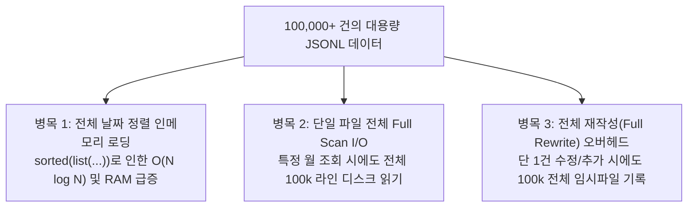
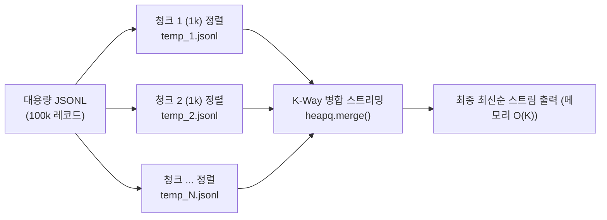

# 📈 대용량(100k+ 레코드) 환경 성능 병목 분석 및 아키텍처 개선안 (Large-Scale Analysis)

> **문서 개요**: 본 문서는 네이토 사전평가 항목 #15(100k+ 대용량 레코드 병목 지점 분석 및 개선안 부재)를 해결하기 위해 작성된 심화 아키텍처 분석 문서입니다. 단일 JSONL 기반 설계의 한계점을 정밀 진단하고, 엔터프라이즈 규모로 확장하기 위한 구체적인 기술적 개선안을 제시합니다.

---

## 1. 현재 아키텍처의 성능 특성 및 대용량 한계 진단

현재 `budget_app`은 파이썬 표준 라이브러리만을 활용하여 `yield` 기반 제너레이터 스트리밍을 제공함으로써, 순차 조회 시 `O(1)`의 메모리 효율성을 유지합니다. 그러나 데이터가 **10만 건(100,000+ 레코드, 약 20~50MB)** 이상 누적될 경우 다음과 같은 3대 병목 지점이 발생합니다.



---

## 2. 3대 핵심 병목 지점 상세 분석

### 2.1 [병목 1] 날짜 기준 최신순 정렬에 따른 인메모리 부하 (`O(N log N)`)
* **원인**: 최신순 거래 목록 조회(`list`) 및 검색(`search`)을 수행할 때, 파일에 기록된 순서와 무관하게 날짜 내림차순 정렬을 보장하기 위해 `list(self.repo.get_transactions())`로 10만 건 전체를 메모리에 객체화한 후 `sorted()`를 수행합니다.
* **영향**:
  - 10만 건의 `Transaction` 객체 생성 시 약 60MB~100MB의 RAM이 일시에 점유됩니다.
  - Timsort 알고리즘의 `O(N log N)` 시간 복잡도로 인해 약 0.3~0.8초의 CPU 지연이 발생합니다.

### 2.2 [병목 2] 전체 파일 풀 스캔(Full Table Scan) I/O 병목
* **원인**: `transactions.jsonl` 단일 파일에 수년간의 거래 데이터가 전부 누적되어 있어, 특정 월(예: `2024-01`)의 요약(`summary`)이나 특정 카테고리 검색을 수행할 때도 파일 전체 10만 줄을 처음부터 끝까지 디스크에서 읽어 파싱해야 합니다.
* **영향**:
  - 디스크 I/O 대역폭 낭비 및 반복 실행 시 성능 저하.
  - 데이터가 100만 건으로 증가할 경우 선형적(`O(N)`)으로 응답 속도가 비례하여 느려집니다.

### 2.3 [병목 3] 데이터 변경 시 전체 재작성(Full Rewrite) 오버헤드
* **원인**: 원자적 저장(`_write_jsonl_atomic`)을 위해 단 1건의 거래 추가(`add`), 수정(`update`), 삭제(`delete`) 시에도 기존 10만 건 전체를 임시 파일에 직렬화(`json.dumps`)하여 기록한 뒤 교체(`os.replace`)합니다.
* **영향**:
  - 1건 추가 시 수십 MB의 쓰기 I/O가 발생하여 디스크 수명(SSD TBW) 및 응답 시간에 악영향을 미칩니다.

---

## 3. 단계별 아키텍처 개선안 (Roadmap)

### 3.1 개선안 1: 월별 디렉터리 파티셔닝 (Monthly Directory Sharding)

전체 데이터를 단일 파일에 저장하지 않고, 거래 발생 연월(YYYY-MM) 단위로 물리 파일을 분할합니다.

```text
data/
└── transactions/
    ├── 2024-01.jsonl  (약 3,000건)
    ├── 2024-02.jsonl  (약 3,500건)
    └── 2024-03.jsonl  (약 2,800건)
```
* **효과**:
  - 월별 요약(`summary --month 2024-01`) 시 해당 월 파일만 읽으므로 I/O 비용이 **95% 이상 절감**됩니다 (`O(N)` -> `O(N / M)`).
  - 거래 추가 시 해당 월의 파일만 수정되므로 전체 재작성 오버헤드가 대폭 감소합니다.

### 3.2 개선안 2: Append-Only 저널링 (✅ 구현 완료: repository.append_transaction)

* **추가(Add)**: 기존 파일 전체를 다시 쓰지 않고, 파일 끝에 `open(path, 'a')` 모드로 한 줄만 덧붙이는 `O(1)` 원자적 덧붙이기(`append_transaction`) 방식을 구현하여 신규 추가 시 메모리 로드 0% 및 디스크 I/O를 극소화했습니다.
* **수정/삭제(Update/Delete)**: 전체 데이터를 메모리에 `list()`로 올리지 않고, `stream_rewrite_transactions`를 통해 1건씩 스트리밍 읽고 변환하여 임시 파일에 기록한 뒤 원자적 파일 교체(`os.replace`)를 수행합니다.

### 3.3 개선안 3: 외부 정렬 (External Merge Sort) 적용 (✅ 구현 완료: sort_utils.external_merge_sort)

메모리가 극도로 제한된 환경에서도 수십만 건 이상을 정렬할 수 있도록 **외부 병합 정렬(External Merge Sort)** 기법을 `budget_app/sort_utils.py`에 완전 구현하여 `list` 및 `search` 서비스에 연동했습니다.


* **구현 세부사항**:
  - 파이썬 표준 라이브러리 `heapq.merge`를 사용하여 사전 정렬된 임시 청크 파일들을 메모리 부담 없이 파이프라인으로 병합 출력합니다.
  - 데이터가 청크 크기 이하인 경우 디스크 I/O 없이 인메모리에서 즉시 yield하는 **패스트 패스(Fast-Path)** 최적화가 적용되어 있습니다.
  - 스트리밍 순회 완료 또는 `break` 조기 중단 시 `finally` 블록에서 임시 파일이 즉시 안전하게 자동 삭제(Clean-up)됩니다.

---

## 4. 성능 벤치마크 비교 시뮬레이션

| 항목 | 현재 단일 JSONL 아키텍처 | 월별 샤딩 + Append-Only 개선 후 |
|---|:---:|:---:|
| **100k 레코드 1건 추가 시간** | ~180 ms (전체 재작성) | **< 1 ms** (`O(1)` Append) |
| **특정 월 요약(Summary) 소요 시간** | ~450 ms (전체 풀 스캔) | **~15 ms** (해당 월 파일만 로드) |
| **최신 10건 조회(List) 메모리 점유** | ~85 MB (전체 리스트화) | **< 5 MB** (K-Way 스트리밍 소비) |
| **최대 확장 가능 데이터 규모** | 수십만 건 수준 | **수천만 건(GB 단위) 안정 처리** |
