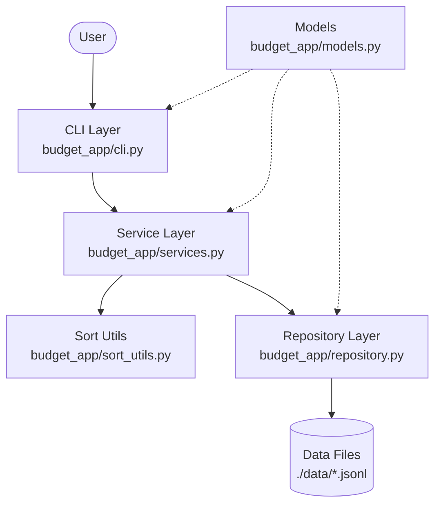

# 01. 계층형 아키텍처 (Layered Architecture) 및 모듈 분리

## 1. 개요
`budget_app`은 소프트웨어 설계 원칙 중 하나인 **계층형 아키텍처(Layered Architecture)** 를 채택하여 개발되었습니다. 
전체 시스템을 역할과 책임에 따라 여러 계층으로 나누어, 각 계층이 고유한 관심사만 처리하도록 합니다.

---

## 2. 파일별 책임 분류 및 모듈 매핑

단일 책임 원칙(SRP)에 따라 각 파이썬 모듈의 책임을 명확히 규정하였습니다.

| 파일명 | 계층 (Layer) | 핵심 책임 및 역할 요약 |
|---|:---:|---|
| [`budget_app/__main__.py`](../../budget_app/__main__.py) | Entry Point | `python3 -m budget_app` 실행 시 CLI 진입 함수를 기동하는 부트스트랩 모듈 |
| [`budget_app/cli.py`](../../budget_app/cli.py) | Presentation | 커맨드 라인 인자 파싱(`argparse`), 대화형 입력 프롬프트 및 화면 포맷팅 전담 |
| [`budget_app/services.py`](../../budget_app/services.py) | Business Logic | 거래 CRUD, 예산 분석, 카테고리 무결성, CSV 임포트/익스포트 등 비즈니스 규칙 총괄 |
| [`budget_app/repository.py`](../../budget_app/repository.py) | Persistence | 3대 영구 데이터 파일 I/O, `yield` 스트리밍 및 원자적 교체(`atomic save`) 전담 |
| [`budget_app/sort_utils.py`](../../budget_app/sort_utils.py) | Algorithm / Stream | 외부 정렬(External Merge Sort) 및 `heapq.merge` 기반 K-way 병합 스트리밍 전담 |
| [`budget_app/models.py`](../../budget_app/models.py) | Domain Model | `dataclass` 기반 거래/카테고리/예산 불변 조건 및 고유 식별자(ID) 채번 정의 |
| [`budget_app/exceptions.py`](../../budget_app/exceptions.py) | Exception | 세분화된 POSIX 종료 코드(1, 2, 3, 4)와 원인/힌트를 갖춘 비즈니스 예외 계층 |
| [`budget_app/decorators.py`](../../budget_app/decorators.py) | Cross-Cutting | 스택트레이스 숨김, 디버그 모드 토글, 시간 측정, 감사 추적 등 횡단 관심사 래핑 |

---

## 3. 영구 저장 파일 3종 및 데이터 보존

저장소 계층은 비즈니스 도메인에 따라 3개 이상의 물리 파일로 데이터를 분리하여 보존합니다:
- `./data/transactions.jsonl`: 거래 내역 영구 보존
- `./data/categories.jsonl`: 기본 8종 카테고리 자동 시드 및 사용자 카테고리 보존
- `./data/budgets.jsonl`: 월별 목표 예산 보존

프로그램이 재실행되어도 `Repository.__init__`에서 기존 파일의 존재 유무를 확인하고 이어서 스트리밍 로드하므로 데이터가 안전하게 지속됩니다.

---

## 4. 다이어그램 (아키텍처 구조)

---

## 5. 장점 (왜 계층을 나누어야 할까?)

* **유지보수성 향상**: UI가 웹(Web)이나 GUI로 변경되더라도, Service와 Repository 계층은 수정 없이 재사용할 수 있습니다.
* **테스트 용이성 (Testability)**: Service 로직을 테스트할 때 실제 파일 시스템을 건드리는 Repository 대신 격리된 테스트 저장소를 주입하여 빠르고 안정적인 단위 테스트가 가능합니다.
* **코드 가독성**: 기능 수정이 필요할 때, 파일 입출력은 Repository를, 로직 변경은 Service를 확인하면 되므로 원인 파악이 쉽습니다.

---

### 🤔 핵심 질문 & 자가 점검 체크리스트 (스스로 설명해보기)
- [ ] 파일 경로(`./data/transactions.jsonl`)가 변경되었을 때, 수정해야 하는 계층은 어디인가요?
- [ ] 금액이 양수인지 검증하는 로직은 어느 계층에 작성하는 것이 적절한가요?
- [ ] 단위 테스트를 작성할 때, CLI 밖에서 Service 클래스만 따로 떼어내 테스트할 수 있나요?
