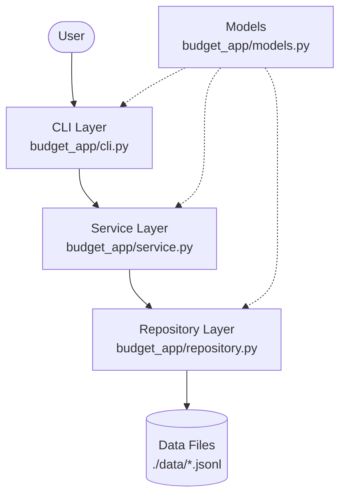

# 01. 계층형 아키텍처 (Layered Architecture)

## 1. 개요
`budget_app`은 소프트웨어 설계 원칙 중 하나인 **계층형 아키텍처(Layered Architecture)** 를 채택하여 개발되었습니다. 
전체 시스템을 역할과 책임에 따라 여러 계층으로 나누어, 각 계층이 고유한 관심사만 처리하도록 합니다.

## 2. 계층 분리 (SRP: 단일 책임 원칙)
프로젝트는 크게 4가지 계층으로 분리되어 있습니다.

- **Models (`budget_app/models.py`)**
  - 시스템의 핵심 데이터 구조(엔티티)를 정의합니다.
  - `Transaction`, `Category`, `Budget` 클래스가 여기에 해당합니다.
- **Repository (`budget_app/repository.py`)**
  - 데이터를 저장하고 불러오는 데이터 영속성(Persistence)을 담당합니다.
  - JSONL 파일 읽기/쓰기, 파일 I/O 스트리밍 처리를 전담합니다.
- **Service (`budget_app/service.py`)**
  - 비즈니스 로직을 처리합니다.
  - 유효성 검사, 필터링, 데이터 가공 등을 수행하며, Repository를 호출해 데이터를 조작합니다.
- **CLI (`budget_app/cli.py`)**
  - 사용자 인터페이스(UI)를 담당합니다.
  - 사용자 입력을 파싱하고 Service를 호출한 뒤, 그 결과를 터미널에 친화적인 형태(예: 테이블)로 출력합니다.

## 3. 다이어그램 (아키텍처 구조)

## 4. 장점 (왜 계층을 나누어야 할까?)

* **유지보수성 향상**: UI가 웹(Web)이나 GUI로 변경되더라도, Service와 Repository 계층은 수정 없이 재사용할 수 있습니다.
* **테스트 용이성 (Testability)**: Service 로직을 테스트할 때 실제 파일 시스템을 건드리는 Repository 대신 Mock 객체를 주입하여 빠르고 안정적인 단위 테스트가 가능합니다.
* **코드 가독성**: 기능 수정이 필요할 때, 파일 입출력은 Repository를, 로직 변경은 Service를 확인하면 되므로 원인 파악이 쉽습니다.

---

### 🤔 핵심 질문 & 자가 점검 체크리스트 (스스로 설명해보기)
- [ ] 파일 경로(`./data/transactions.jsonl`)가 변경되었을 때, 수정해야 하는 계층은 어디인가요?
- [ ] 금액이 양수인지 검증하는 로직은 어느 계층에 작성하는 것이 적절한가요?
- [ ] 단위 테스트를 작성할 때, CLI 밖에서 Service 클래스만 따로 떼어내 테스트할 수 있나요?
