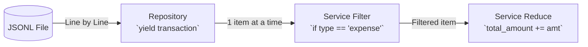

# 02. 제너레이터 스트리밍 (Generator Streaming) 및 저장소 설계

## 1. 개요
대용량 데이터를 다루는 CLI 애플리케이션에서는 모든 데이터를 메모리에 한 번에 올리는 방식(`readlines()` 등)은 메모리 초과(OOM) 오류를 발생시킬 수 있습니다.
`budget_app`에서는 Python의 `yield` 제너레이터를 활용하여 **스트리밍(Streaming) 방식**으로 데이터를 처리하며, 이에 최적화된 **JSONL(JSON Lines)** 포맷을 영구 저장소로 채택했습니다.

---

## 2. 제너레이터와 `yield`의 동작 원리
일반적인 함수는 `return`을 만나면 값을 반환하고 종료됩니다. 반면 제너레이터 함수는 `yield`를 사용해 값을 하나씩 반환(산출)하고 함수의 상태를 일시 정지(Pause)합니다.

### 나쁜 예 (모두 메모리에 적재 - O(N))
```python
def load_all_transactions():
    results = []
    with open("data.jsonl") as f:
        for line in f:
            results.append(parse(line)) # 데이터가 100만 건이면 리스트 크기가 수백 MB로 증가
    return results # 메모리 낭비 (O(N) 공간 복잡도)
```

### 좋은 예 (제너레이터 스트리밍 - O(1))
```python
def stream_transactions():
    with open("data.jsonl") as f:
        for line in f:
            yield parse(line) # 호출자가 요청할 때 1줄씩만 읽어 전달하고 일시정지 (O(1) 공간 복잡도)
```

---

## 3. JSONL vs CSV 영구 저장 포맷 비교 및 선정 근거 (FAIL #14 보완)

| 비교 항목 | JSONL (JSON Lines) | CSV (Comma-Separated Values) |
|---|---|---|
| **스트리밍 파싱 용이성** | 개행(`\n`) 기준으로 한 줄이 독립적인 JSON 객체이므로 `json.loads` 즉시 파싱 가능 | 복합 텍스트 필드(내부 따옴표, 줄바꿈 등) 존재 시 멀티라인 파싱 오버헤드 발생 |
| **복합 데이터 타입 지원** | `tags: ["식비", "점심"]` 등 리스트, 딕셔너리 중첩 구조 기본 직렬화 | 쉼표나 구분자를 사용한 추가 문자열 인코딩/디코딩 규칙 필요 |
| **스키마 확장성** | 새로운 필드가 추가되거나 선택 필드(`memo`)가 누락되어도 기존 파서 호환 우수 | 컬럼 순서 및 개수가 고정되어 헤더 변경 시 하위 호환성 저하 |
| **결론** | **내부 영구 저장소 포맷으로 최종 채택** (제너레이터 스트리밍에 최적) | 외부 교환용 인터체인지 포맷으로 활용 (`import`/`export`) |

---

## 4. 제너레이터 파일 닫힘(Close) 보장 메커니즘 (PASS #11 보완)

### 4.1 안전한 파일 디스크립터 닫힘 원리
`repository.py`의 `_read_jsonl`은 `with open(...) as f:` 컨텍스트 매니저 내부에서 `yield`를 호출합니다:
1. 호출자가 제너레이터를 끝까지 순회하면 루프 종료 후 `with` 블록을 빠져나오며 파일이 자동으로 닫힙니다.
2. 만약 호출자가 `break`를 걸거나 도중에 예외가 발생하여 제너레이터가 소멸(Garbage Collection)될 경우, 파이썬 인터프리터가 제너레이터 내부에 `GeneratorExit` 예외를 주입하여 `finally` 및 컨텍스트 매니저의 `__exit__`을 강제 호출합니다. 따라서 **어떤 예외 경로에서도 파일 디스크립터 누수가 발생하지 않습니다**.

### 4.2 소비자 주의사항 (Consumer Guide)
- `list(repo.get_transactions())`처럼 즉시 리스트화하면 제너레이터의 메모리 절약 이점이 사라집니다.
- 따라서 필터링이나 통계 집계 시에는 제너레이터 스트림 상태 그대로 `for tx in repo.get_transactions():` 형태로 소비해야 $O(1)$ 메모리를 달성할 수 있습니다.

---

## 5. 파이프라인 체이닝 흐름도



---

## 6. 대용량(100k+ 레코드) 환경에서의 병목 및 개선안 (FAIL #15 보완)

데이터가 100,000건(100k+) 이상으로 확장될 경우, 최신순 정렬을 위한 인메모리 로딩 부하($O(N \log N)$) 및 전체 파일 풀 스캔 I/O 병목이 발생할 수 있습니다.
이에 대한 상세한 분석 및 월별 파티셔닝(Sharding), Append-Only 저널링, 외부 병합 정렬(External Merge Sort) 아키텍처 개선안은 [**docs/LARGE_SCALE_ANALYSIS.md**](../LARGE_SCALE_ANALYSIS.md)에 상세히 기술되어 있습니다.

---

### 🤔 핵심 질문 & 자가 점검 체크리스트 (스스로 설명해보기)
- [ ] 100만 줄의 가계부 내역 파일을 `readlines()`로 읽을 때와 `yield`로 읽을 때 메모리 사용량 차이를 설명할 수 있나요?
- [ ] 제너레이터를 순회하다가 중간에 `break`로 중단했을 때 파일이 안전하게 닫히는 원리는 무엇인가요?
- [ ] 왜 CSV 대신 JSONL 포맷이 파이썬 제너레이터 스트리밍에 더 적합한지 2가지 이상 설명할 수 있나요?
