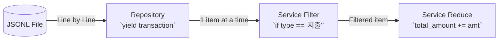

# 02. 제너레이터 스트리밍 (Generator Streaming)

## 1. 개요
대용량 데이터를 다루는 CLI 애플리케이션에서는 모든 데이터를 메모리에 한 번에 올리는 방식(`readlines()` 등)은 메모리 초과(OOM) 오류를 발생시킬 수 있습니다.
`budget_app`에서는 Python의 `yield` 제너레이터를 활용하여 **스트리밍(Streaming) 방식**으로 데이터를 처리합니다.

## 2. 제너레이터와 `yield`
일반적인 함수는 `return`을 만나면 값을 반환하고 종료됩니다. 반면 제너레이터 함수는 `yield`를 사용해 값을 하나씩 반환(산출)하고 함수의 상태를 일시 정지(Pause)합니다.

### 나쁜 예 (모두 메모리에 적재)
```python
def load_all_transactions():
    results = []
    with open("data.jsonl") as f:
        for line in f:
            results.append(parse(line)) # 데이터가 100만 건이면 리스트 크기가 엄청 커짐
    return results # 메모리 낭비 (O(N))
```

### 좋은 예 (제너레이터 스트리밍)
```python
def stream_transactions():
    with open("data.jsonl") as f:
        for line in f:
            yield parse(line) # 값을 하나씩 전달하고 메모리 점유를 최소화 (O(1))
```

## 3. 메모리 효율성 O(1)
`budget_app/repository.py` 내부에서는 파일을 한 줄씩 읽어 Model 객체로 변환한 뒤 `yield` 합니다.
Service 계층은 이 제너레이터를 받아 필요한 조건(예: 특정 카테고리 필터링)에 맞는 항목만 골라내어 연산합니다. 이 파이프라인 체이닝(Pipeline Chaining) 덕분에, 파일이 수 기가바이트(GB)에 달하더라도 메모리 사용량은 일정하게 유지(O(1))됩니다.

## 4. 파이프라인 체이닝 흐름도



---

### 🤔 핵심 질문 & 자가 점검 체크리스트 (스스로 설명해보기)
- [ ] 100만 줄의 가계부 내역 파일을 `readlines()`로 읽을 때와 `yield`로 읽을 때 메모리 사용량 차이를 설명할 수 있나요?
- [ ] 제너레이터를 사용할 때, 파일은 언제 닫히(close)게 되나요?
- [ ] 제너레이터에서 `yield`된 데이터를 한 번 순회(for문)한 뒤, 다시 순회하려면 어떻게 해야 할까요?
