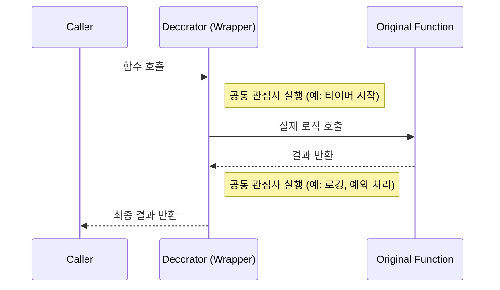

# 03. 데코레이터 패턴과 공통 관심사 분리

## 1. 개요
Python의 **데코레이터(Decorator)** 는 기존 함수의 코드를 수정하지 않고, 그 함수에 앞뒤로 새로운 기능을 추가(래핑, Wrapping)할 수 있게 해주는 강력한 문법입니다.
`budget_app`에서는 로깅, 실행 시간 측정, 예외 래핑(Exception Wrapping)과 같은 **공통 관심사(Cross-cutting Concerns)** 를 분리하기 위해 데코레이터를 사용합니다.

## 2. 왜 공통 관심사를 분리해야 할까?
비즈니스 로직(예: 거래 내역 추가, 조회) 내부에 매번 로깅 코드와 실행 시간 측정 코드를 넣으면 중복이 발생하고, 실제 비즈니스 로직을 파악하기 어려워집니다.

### 나쁜 예 (비즈니스 로직과 로깅이 섞임)
```python
def add_transaction(tx):
    start_time = time.time()
    try:
        # 실제 핵심 로직
        repo.save(tx)
    except Exception as e:
        logger.error(f"Error: {e}")
        raise
    finally:
        print(f"Execution time: {time.time() - start_time}s")
```

### 좋은 예 (데코레이터를 통한 분리)
```python
@measure_time
@handle_exceptions
def add_transaction(tx):
    # 실제 핵심 로직에만 집중!
    repo.save(tx)
```

## 3. `@functools.wraps`의 원리와 중요성
커스텀 데코레이터를 만들 때 `@functools.wraps(func)`를 내부 래퍼(Wrapper) 함수에 붙이는 것이 파이썬의 권장 사항(Best Practice)입니다.
만약 붙이지 않는다면, 원래 함수(`add_transaction`)의 이름(`__name__`)이나 독스트링(`__doc__`) 등의 메타데이터가 래퍼 함수의 이름으로 덮어씌워지는 문제가 발생하여 디버깅이 힘들어집니다.

```python
import functools
import time

def measure_time(func):
    @functools.wraps(func)  # 원본 함수의 메타데이터 보존
    def wrapper(*args, **kwargs):
        start = time.time()
        result = func(*args, **kwargs)
        print(f"Elapsed: {time.time() - start}s")
        return result
    return wrapper
```

## 4. 다이어그램 (데코레이터 동작 원리)



---

### 🤔 핵심 질문 & 자가 점검 체크리스트 (스스로 설명해보기)
- [ ] 데코레이터를 사용하지 않고 모든 함수에 예외 처리 코드를 직접 작성하면 발생할 수 있는 문제점은 무엇인가요?
- [ ] `@functools.wraps`를 사용하지 않았을 때, `print(add_transaction.__name__)`의 출력 결과는 어떻게 달라질까요?
- [ ] 여러 개의 데코레이터를 중첩해서 사용할 때(`@A` 다음 줄에 `@B`), 함수는 어느 데코레이터부터 실행(래핑)될까요?
