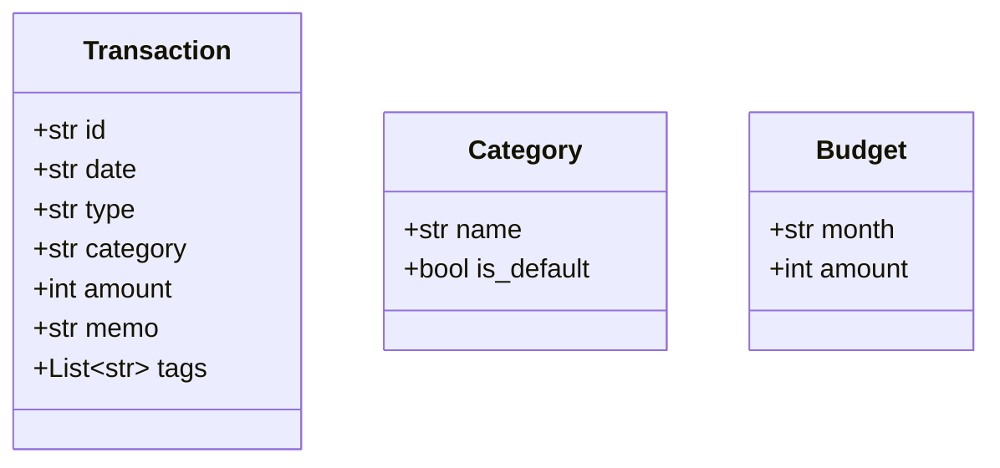

# 04. 타입 힌트와 Dataclass

## 1. 개요
Python 3.5부터 도입된 **타입 힌트(Type Hints)** 와 3.7부터 도입된 **Dataclass**는 모던 파이썬 개발의 핵심입니다.
`budget_app`은 딕셔너리(`dict`) 대신 강력한 타입 힌트와 결합된 Dataclass를 사용하여 안정적인 **데이터 계약(Data Contract)** 을 설계했습니다.

## 2. 딕셔너리(Dict) 대비 Dataclass의 장점
일반적으로 JSON 데이터를 다룰 때 `dict`를 많이 사용하지만, 시스템이 커지면 유지보수 문제가 발생합니다.

### 나쁜 예 (Dict 사용 시 문제점)
```python
# 딕셔너리는 오타에 취약하고 자동완성이 지원되지 않음
tx = {"date": "2023-10-01", "type": "지출", "amount": 10000}
print(tx["amout"]) # KeyError 발생 (오타)
```

### 좋은 예 (Dataclass 사용)
```python
from dataclasses import dataclass
from typing import List

@dataclass
class Transaction:
    date: str
    type: str
    category: str
    amount: int
    memo: str = ""
    tags: List[str] = None
```
- IDE(PyCharm, VSCode)에서 **자동완성**을 완벽하게 지원합니다.
- `Transaction.amount`처럼 객체의 속성으로 안전하게 접근할 수 있습니다.
- `__init__`, `__repr__`, `__eq__` 등의 매직 메서드를 자동으로 생성해 주어 코드가 간결해집니다.

## 3. 데이터 계약 (Data Contract)
타입 힌트는 단순한 힌트를 넘어, 각 계층 간에 데이터를 주고받을 때의 **계약서** 역할을 합니다.
Service 계층이 Repository에서 데이터를 받을 때, 반환 타입이 `List[Transaction]` (또는 `Generator[Transaction, None, None]`)이라는 것을 명확히 알면, 내부 구조를 일일이 확인하지 않아도 안전하게 로직을 작성할 수 있습니다.


*(위 클래스들은 실제 `budget_app/models.py`에 정의되어 있습니다.)*

## 4. Python 3.10+ 타입 힌트 특징
- 최신 파이썬 문법에서는 `Union[int, str]` 대신 `int | str`로 깔끔하게 타입을 지정할 수 있습니다.
- `Optional[str]` 대신 `str | None`을 권장합니다.
- `budget_app` 프로젝트는 가독성을 높이기 위해 이러한 모던 타입 힌트 스타일을 적극 채용할 수 있습니다.

---

### 🤔 핵심 질문 & 자가 점검 체크리스트 (스스로 설명해보기)
- [ ] 파이썬의 타입 힌트는 런타임 성능이나 실행 결과에 직접적인 영향을 미치나요?
- [ ] Dataclass에서 가변 객체(예: `list`)를 기본값(default)으로 설정할 때, `tags: list = []` 대신 `field(default_factory=list)`를 사용해야 하는 이유는 무엇인가요?
- [ ] 여러 계층이 협력하는 아키텍처에서 타입 힌트와 Dataclass가 어떻게 런타임 에러를 줄여주는지 설명할 수 있나요?
