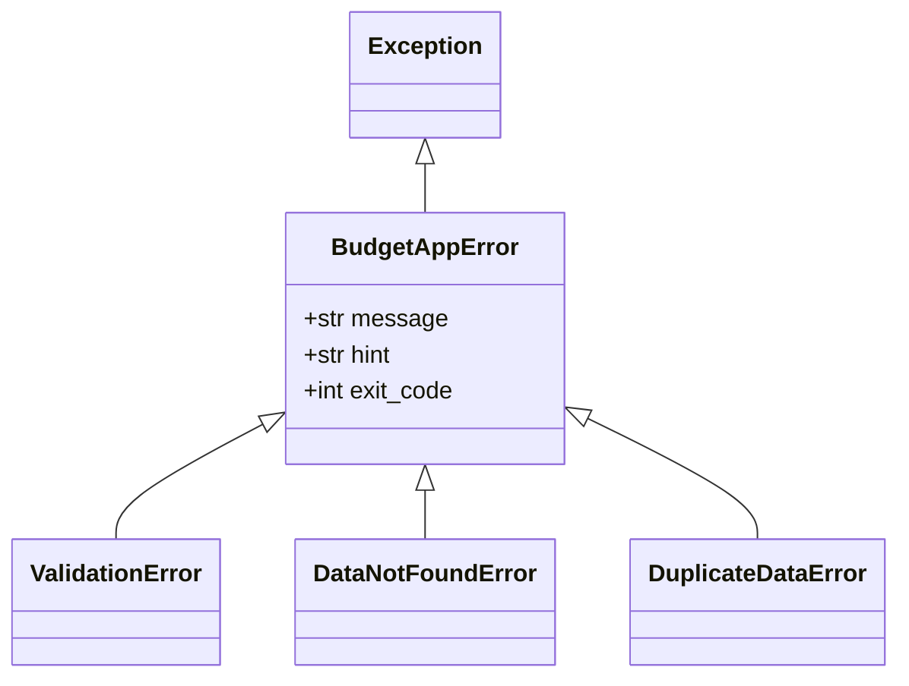

# 05. 에러 핸들링과 CLI 사용자 경험 (UX)

## 1. 개요
CLI(Command Line Interface) 환경에서 훌륭한 사용자 경험(UX)을 제공하기 위해서는 에러가 발생했을 때 사용자가 당황하지 않도록 친절하고 명확하게 안내하는 것이 필수적입니다.
`budget_app`은 복잡한 **스택 트레이스(Stack Trace)를 숨기고**, 사용자가 이해할 수 있는 에러 메시지와 **해결 힌트**를 제공하도록 설계되었습니다.

## 2. 사용자 친화적인 에러 메시지
개발 중에는 버그 추적을 위해 스택 트레이스가 유용하지만, 실제 프로덕션 환경의 일반 사용자는 긴 영어 문장의 파이썬 오류(`Traceback...`)를 보면 앱이 고장났다고 생각하게 됩니다.

### 나쁜 예 (스택 트레이스 노출)
```
Traceback (most recent call last):
  File "main.py", line 42, in <module>
ValueError: Amount cannot be negative.
```

### 좋은 예 (사용자 친화적 메시지와 힌트)
```
[오류] 지출 금액이 잘못 입력되었습니다.
원인: 금액은 0보다 큰 양수여야 합니다. (입력값: -5000)
해결: 'add' 명령어의 금액 부분을 다시 확인하고 입력해주세요.
```

## 3. 커스텀 예외 (Custom Exceptions)
이러한 사용자 친화적 에러를 구현하기 위해 `budget_app/exceptions.py`에 커스텀 예외 클래스 계층을 만듭니다.


* **ValidationError**: 잘못된 데이터 포맷(날짜 형식 틀림 등)
* **DataNotFoundError**: 조회하려는 내역이나 카테고리가 없을 때
* **DuplicateDataError**: 이미 등록된 데이터를 다시 등록하려고 할 때

## 4. POSIX Exit Code 규격
CLI 도구는 스크립트나 다른 프로그램과 연동되어 자동화 목적으로 자주 사용됩니다. 이때 프로그램의 정상/비정상 종료 상태를 운영체제(OS)에 정확히 알리는 것이 중요합니다.
- `sys.exit(0)`: 정상 종료 (성공)
- `sys.exit(1)`: 일반적인 에러 발생
- `sys.exit(2)`: CLI 명령어 인자(argument) 파싱 오류

최상위 CLI 진입점(`budget_app/__main__.py` 또는 `cli.py`)에서 전역 `try-except` (또는 데코레이터)로 `BudgetAppError`를 잡아, 에러 메시지를 예쁘게 출력하고 적절한 종료 코드로 `sys.exit(code)`를 호출합니다.

---

### 🤔 핵심 질문 & 자가 점검 체크리스트 (스스로 설명해보기)
- [ ] 일반 사용자를 위해 파이썬의 기본 에러 메세지(Traceback)를 숨겨야 하는 구체적인 이유는 무엇인가요?
- [ ] 파이썬 코드에서 예외를 처리할 때 단순히 `except Exception:`으로 뭉뚱그려 잡는 것(Catch-all)이 안 좋은 프랙티스로 여겨지는 이유는 무엇인가요?
- [ ] CLI 프로그램이 비정상 종료되었음에도 `sys.exit(0)`을 반환하면, 이를 활용하는 다른 자동화 쉘 스크립트(Bash 등)에서는 어떤 문제가 발생할 수 있나요?
