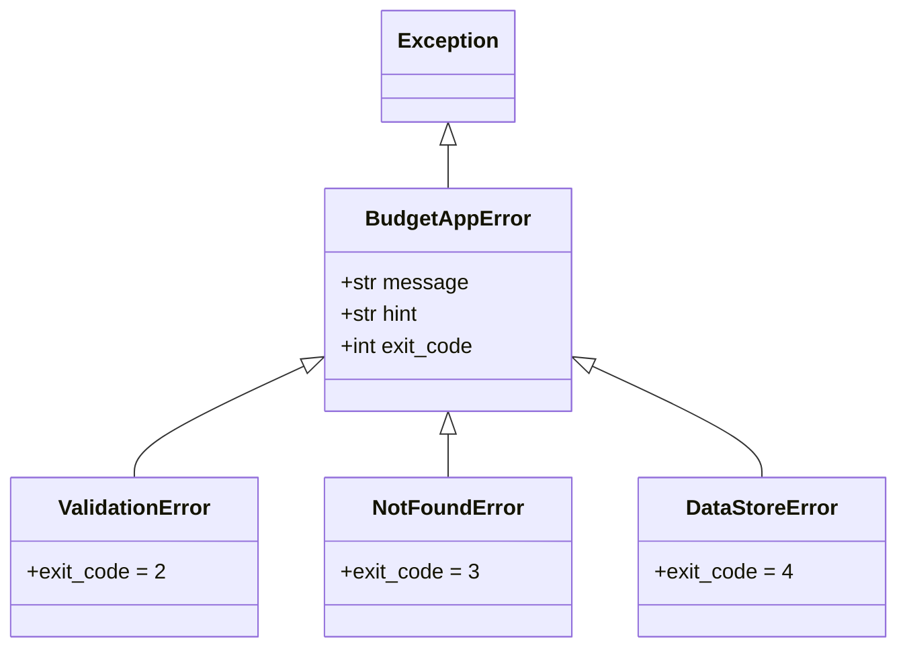

# 05. 에러 핸들링과 CLI 사용자 경험 (UX)

## 1. 개요
CLI(Command Line Interface) 환경에서 훌륭한 사용자 경험(UX)을 제공하기 위해서는 에러가 발생했을 때 사용자가 당황하지 않도록 친절하고 명확하게 안내하는 것이 필수적입니다.
`budget_app`은 복잡한 **스택 트레이스(Stack Trace)** 를 숨기고, 사용자가 이해할 수 있는 에러 메시지와 **해결 힌트** 를 제공하며, 세분화된 **POSIX 종료 코드(Exit Code)** 를 반환하도록 설계되었습니다.

---

## 2. 사용자 친화적인 에러 메시지
개발 중에는 버그 추적을 위해 스택 트레이스가 유용하지만, 실제 프로덕션 환경의 일반 사용자는 긴 영어 문장의 파이썬 오류(`Traceback...`)를 보면 앱이 고장났다고 생각하게 됩니다.

### 나쁜 예 (스택 트레이스 노출)
```
Traceback (most recent call last):
  File "main.py", line 42, in <module>
ValueError: Amount cannot be negative.
```

### 좋은 예 (사용자 친화적 메시지와 힌트)
```
[오류] 날짜 형식이 올바르지 않습니다 (YYYY-MM-DD).
[힌트] 예: 2024-01-15
```

---

## 3. 커스텀 예외 (Custom Exceptions) 계층 구조

이러한 사용자 친화적 에러를 구현하기 위해 `budget_app/exceptions.py`에 커스텀 예외 클래스 계층을 정의합니다.



---

## 4. POSIX Exit Code 매핑 표 (PASS #7 보완)

CLI 도구는 스크립트나 CI/CD 파이프라인에서 자동화 목적으로 자주 사용됩니다. 이때 오류의 원인을 기계(스크립트)가 식별할 수 있도록 세분화된 exit code를 반환합니다.

| Exit Code | 예외 클래스 | 발생 원인 | 콘솔 출력 메시지 예시 |
|:---:|---|---|---|
| **0** | - | 모든 명령 정상 실행 완료 | `[저장 완료] id=TX-XXXXXX` |
| **1** | `BudgetAppError` | 일반 런타임 오류 또는 알 수 없는 예외 | `[오류] 알 수 없는 오류가 발생했습니다` |
| **2** | `ValidationError` | 날짜 형식 오류, 음수 금액, 미등록 카테고리 등 | `[오류] 날짜 형식이 올바르지 않습니다 (YYYY-MM-DD).` |
| **3** | `NotFoundError` | 존재하지 않는 거래 ID 조회/수정/삭제 시 | `[오류] ID 'TX-NOTFOUND'에 해당하는 거래를 찾을 수 없습니다.` |
| **4** | `DataStoreError` | 파일 읽기/쓰기 권한 및 디스크 I/O 오류 시 | `[오류] 파일 저장 중 오류가 발생했습니다` |

---

### 🤔 핵심 질문 & 자가 점검 체크리스트 (스스로 설명해보기)
- [ ] 일반 사용자를 위해 파이썬의 기본 에러 메세지(Traceback)를 숨겨야 하는 구체적인 이유는 무엇인가요?
- [ ] 파이썬 코드에서 예외를 처리할 때 단순히 `except Exception:`으로 뭉뚱그려 잡는 것(Catch-all)이 안 좋은 프랙티스로 여겨지는 이유는 무엇인가요?
- [ ] CLI 프로그램이 비정상 종료되었음에도 `sys.exit(0)`을 반환하면, 이를 활용하는 다른 자동화 쉘 스크립트(Bash 등)에서는 어떤 문제가 발생할 수 있나요?
